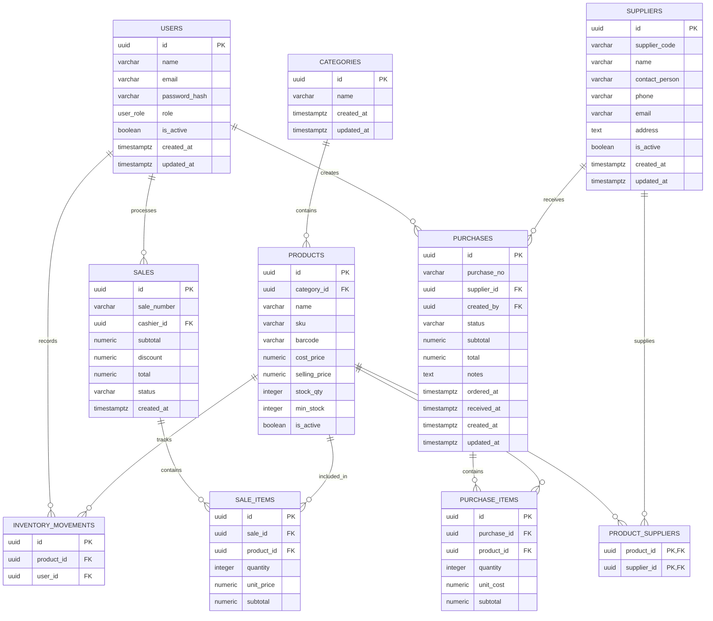

# Entity Relationship Diagram



## Relationship Summary

```text
Users
├── create Purchases
├── process Sales
└── record Inventory Movements

Categories
└── contain Products

Products
├── belong to Categories
├── belong to Purchases through Purchase Items
├── belong to Sales through Sale Items
├── have Inventory Movements
└── have Suppliers through Product Suppliers

Suppliers
├── provide Products through Product Suppliers
└── are associated with Purchases

Purchases
└── contain Purchase Items

Sales
└── contain Sale Items
```
